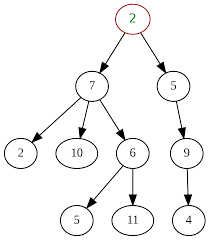

# Tree

Golang package tree is pure golang implementation of tree with any direction nodes. Each node in the tree can be connected to many children and has many parents.



In the implementation of this tree, parents are no different from children. The tree element contains references to branches without specifying whether it is a parent or a child.

Each node reference in an element contains a path cost that is taken into account when calculating the path from point A to point B. The path between points A and B calculates using threads (parallel) to minimize time of find all paths.

This tree has no root. Paths in a tree can be looped.

The tree elements can store any data structure. This structure is defined when the tree is created.

[](https://godoc.org/github.com/kirill-scherba/tree/)
[](https://goreportcard.com/report/github.com/kirill-scherba/tree)

## How to install it

The reference implementation in this repo is written in Go. To use tree
in a Go program, install the code using this command: `go get -u github.com/kirill-scherba/tree`.

## How to use it

There is basic example `./examples/simple/` which use basic tree functions. You can execute it locally:

```bash
go run ./examples/simple/
```

or run it directly from github:

```bash
go run github.com/kirill-scherba/tree/examples/simple@latest
```

This sample creates tree. And some elements, set path between elements. Print the tree and calculate path between elements.

```bash
Print tree example:

. My first element
├── My first child, cost: 1.00
│   ├── My first element, cost: 1.00 🡡
│   └── My fourth child, cost: 1.00
│       ├── My first element, cost: 3.00 🡡
│       ├── Some third child, cost: 1.00
│       │   ├── My second child, cost: 1.00
│       │   │   ├── My first element, cost: 3.00 🡡
│       │   │   ├── Some third child, cost: 1.00 🡡
│       │   │   └── End point, cost: 1.00
│       │   │       ├── My second child, cost: 1.00 🡡
│       │   │       ├── My fourth child, cost: 1.00 🡡
│       │   │       └── My first element, cost: 5.00 (one way road) 🡡
│       │   └── My fourth child, cost: 1.00 🡡
│       ├── My first child, cost: 1.00 🡡
│       └── End point, cost: 1.00 🡡
├── My second child, cost: 3.00 🡡
├── My fourth child, cost: 3.00 🡡
└── End point, cost: 5.00 (way not allowed) 🡡
```

You can find complete packets documentation at: <https://pkg.go.dev/github.com/kirill-scherba/tree>

## Licence

[BSD](LICENSE)
